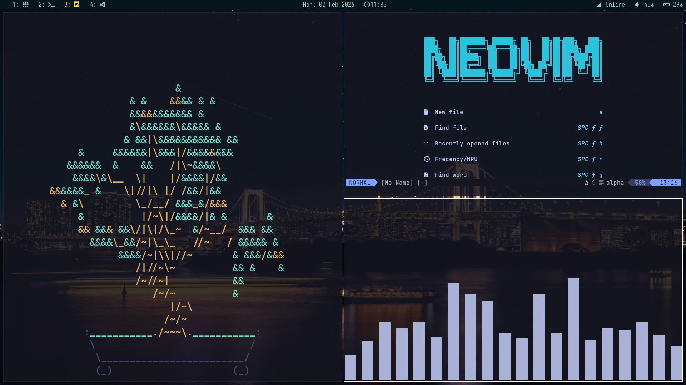

# Hot Dotfiles🔥
My personal Arch Linux Configuration which I've built over years. I admit I've blatantly copied a few people's configurations from GitHub and I've tried to give them credit in the config files in comments. 

I still don't think this is complete but as of now I've no real interest of writing the missing bash scripts which aren't here🫠

My ricing philosophy is simple, make everything look pretty but always in a useful state. I don't like those super smooth fade transitions which picom provides. It looks aesthetic but terrible for any serious work.

### Highlights of Setup 🖥️
* **Distribution**: [Arch Linux](https://archlinux.org/) as I said.

* **GTK Theme/Color Scheme:** Recently switched to _Tokyo Night_. Was earlier using _Ayu_ or _Mayukai_.
* **🐱 Terminal**: [Kitty](https://github.com/kovidgoyal/kitty) with _Tokyo Night_.

* **🪟 Window Manager:** [i3](https://github.com/i3/i3) with [picom](https://github.com/yshui/picom) as compositor.

* **Polybar:** [Hack Theme](https://github.com/adi1090x/polybar-themes) with slight modifications from the [famous repository](https://github.com/adi1090x/polybar-themes) by `adi1090x`.

* **Font:** ``JetBrainsMono NF``, a Nerd Font.

* **Shell:** Zsh shell with [Powerlevel10k](https://github.com/romkatv/powerlevel10k)

* **✏️ Text Editor**: [Neovim](https://github.com/neovim/neovim) with [lazy.nvim](https://github.com/folke/lazy.nvim) along with [VS Code](https://code.visualstudio.com/) and [Sublime Text](https://www.sublimetext.com/) occasionally.

* **$\TeX$ Distribution**: [TexLive](https://tug.org/texlive/) for Linux of course.

* **📄 PDF Viewer:** [Zathura](https://pwmt.org/projects/zathura/) with [PDF-Poppler Plugin](https://pwmt.org/projects/zathura-pdf-poppler/).

* **🌐 Browser**: [Zen Browser](https://zen-browser.app/) but takes too much RAM. Would switch back to [Firefox](https://www.firefox.com/) once it stops lagging for me.

### Installation 🚀
To download the dotfiles, I'll eventually write a bash script which extracts everything from this github repository and makes the correct symlink. This is a TODO.

## 📝 Notes on Ricing

I use ``i3-wm`` with ``i3-gaps``. The programs active in the screenshot are ``cbonsai``, ``nvim`` and ``cava``. The ``polybar`` theme and configuration is available in [polybar directory](./polybar/). The wallpaper is available in [wallpapers directory](./wallpapers/).

No fancy fade animations — ``picom`` is only used to add terminal transparency.